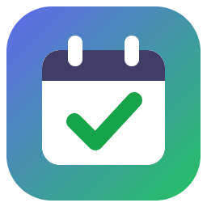

# Planner

Um planner diário para Windows: você organiza o que precisa (ou quer) fazer em cada dia, com ou sem horário marcado.



## Como funciona

### Dois jeitos de ver o seu dia

- **Cronograma** — uma linha do tempo de 00h a 24h, como uma agenda. Cada atividade aparece como um bloco no horário em que acontece. Dá para **arrastar o bloco** para mudar o horário ou **puxar a borda de baixo** para mudar a duração. Um duplo clique num horário vazio cria uma atividade ali. A linha vermelha mostra a hora atual.
- **Geral** — uma lista simples, estilo checklist, com tudo o que você vai fazer no dia, sem se preocupar com horários. As mais importantes ficam no topo e as concluídas vão para o final.

Você alterna entre os dois modos pelos botões no topo da tela. As atividades são as mesmas nos dois modos: só muda a forma de ver.

### Atividades

Cada atividade pode ter:

- **Horário** de início e fim (opcional)
- **Categoria** com cor — você cria as suas (Trabalho, Estudos, Saúde…) no botão *Categorias*
- **Prioridade** — Urgente, Alta, Média ou Baixa
- **Descrição**
- **Checklist** — pequenas etapas para marcar conforme avança
- **Comentários** — anotações com data e hora
- **Anexos** — arquivos do computador (PDFs, imagens, planilhas…), que ficam guardados no próprio Planner

Clique numa atividade para abrir os detalhes na lateral. Para concluir, use a caixinha ao lado do nome ou o botão **✓ Concluir**.

### Atividades que se repetem

Na seção *Repetição* de uma atividade, escolha **Diariamente** ou **Semanalmente** (e os dias da semana). A atividade passa a aparecer sozinha nos próximos dias. Cada dia tem sua própria cópia: concluir hoje não marca amanhã como feito.

### Avisos no horário

No modo **Cronograma**, com o botão 🔔 **Notificações** ligado, o Planner avisa você:

1. **Quando a atividade começa** — uma notificação do Windows.
2. **Quando faltam 10 minutos para acabar** — uma janelinha no canto da tela pergunta **"Você já finalizou?"**
   - **Sim, finalizei** → a atividade é marcada como concluída.
   - **Ainda não** → você recebe um novo aviso quando faltar **1 minuto**.

Atividades já concluídas não geram avisos.

> **Importante:** ao fechar a janela no **X**, o Planner continua rodando na **bandeja do sistema** (perto do relógio) para poder avisar você. Para abrir de novo, clique no ícone. Para sair de verdade, clique com o botão direito no ícone e escolha **Sair**.

### Outras facilidades

- Navegue entre os dias com as setas ou o calendário no topo; o botão **Hoje** volta para o dia atual.
- A barra lateral mostra o progresso do dia e filtra as atividades por categoria.
- **Copiar pendentes do dia anterior** traz para hoje o que ficou por fazer ontem.
- Atalhos: `Ctrl + N` cria uma atividade; `Esc` fecha o painel aberto.

### Onde ficam os seus dados

Tudo é salvo automaticamente no seu computador, na pasta `%APPDATA%\Planner` (cole esse endereço na barra do Explorador de Arquivos para abrir). Nada é enviado para a internet. Como os dados ficam separados do programa, você pode mover ou atualizar o `Planner.exe` sem perder nada.

## Como gerar o executável (Windows)

### 1. Instale o Node.js (só na primeira vez)

Baixe e instale a versão **LTS** em [nodejs.org](https://nodejs.org). Para conferir se deu certo, abra o PowerShell e rode:

```powershell
node --version
```

Deve aparecer algo como `v20.x.x` (ou mais recente).

### 2. Baixe o projeto

Com o Git instalado:

```powershell
git clone https://github.com/SEU-USUARIO/NOME-DO-REPO.git
cd NOME-DO-REPO
```

Ou baixe o ZIP pelo botão verde **Code → Download ZIP** no GitHub, extraia e abra o PowerShell dentro da pasta extraída.

### 3. Instale as dependências (só na primeira vez)

```powershell
npm install
```

Isso baixa o Electron e as ferramentas de empacotamento (pode levar alguns minutos).

### 4. Gere o executável

```powershell
npm run dist
```

Ao terminar, o programa estará em:

```
dist\Planner.exe
```

É um executável **portátil**: não precisa instalar, basta dar dois cliques. Você pode copiá-lo para qualquer pasta ou criar um atalho na Área de Trabalho (botão direito no arquivo → *Enviar para* → *Área de trabalho (criar atalho)*).

> Na primeira vez que abrir, o Windows pode mostrar a tela azul *"O Windows protegeu o computador"*, porque o programa não tem assinatura digital. Clique em **Mais informações → Executar assim mesmo**.

> Se o `Planner.exe` estiver aberto (inclusive na bandeja), feche-o pelo menu **Sair** antes de rodar `npm run dist` de novo.

### Outros comandos úteis

| Comando | O que faz |
| --- | --- |
| `npm start` | Abre o app direto do código, sem gerar o executável (útil para testar mudanças) |
| `npm run icon` | Gera de novo os arquivos de ícone (`build/icon.ico` e `src/icon.png`) |

## Estrutura do projeto

```
main.js            Processo principal: janela, bandeja, notificações, arquivos
preload.js         Ponte segura entre a janela e o sistema
alert-preload.js   Ponte da janelinha "Você já finalizou?"
src/
  index.html       Tela principal
  app.js           Lógica do planner (atividades, modos, repetição, avisos)
  styles.css       Visual
  alert.html/.js   Janelinha de alerta com Sim/Não
  icon.png         Ícone
build/icon.ico     Ícone do executável
scripts/           Script que desenha o ícone
```

Feito com [Electron](https://www.electronjs.org/), usando HTML, CSS e JavaScript puros.
